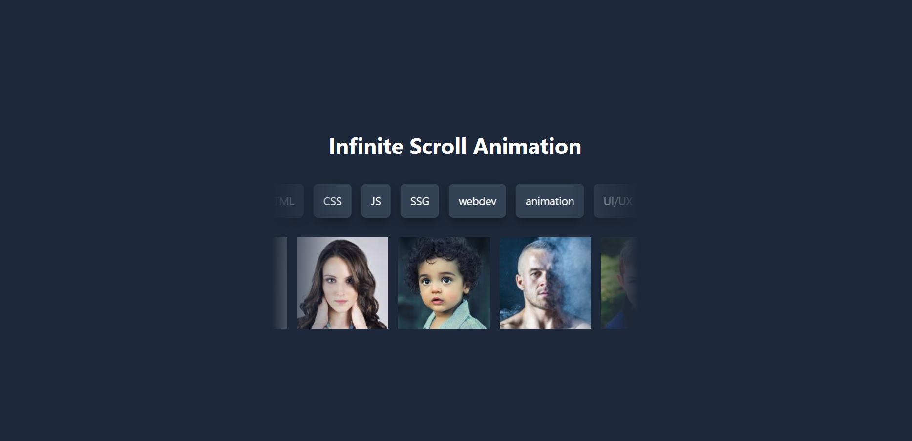

# :desktop_computer: React Hook Form

## :briefcase: Stacks

- React/Next (JavaScript/TypeScript)

## :hammer: Tools

- Git
- NodeJs
- Yarn
- VS Code

## :fire: Run

- Development (Port 300): `yarn dev`
